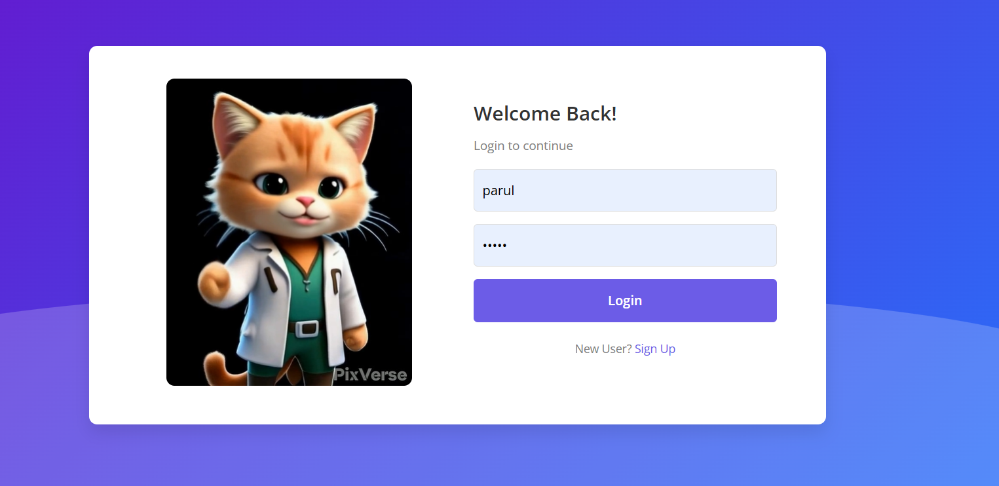
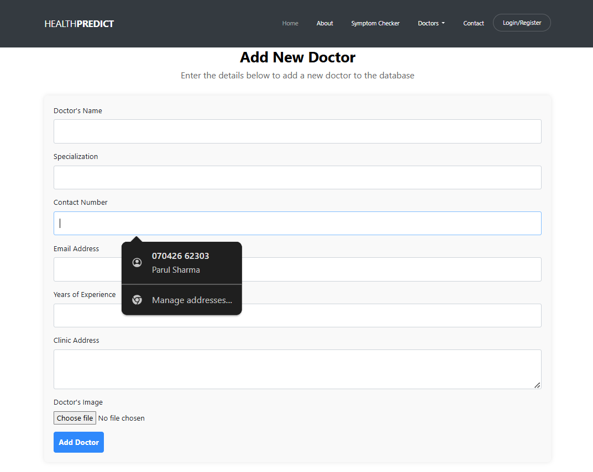
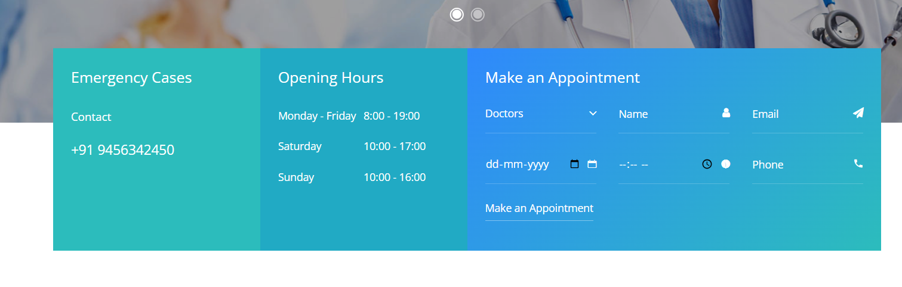
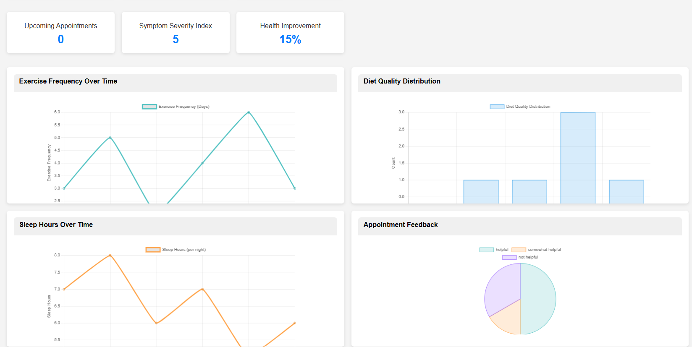
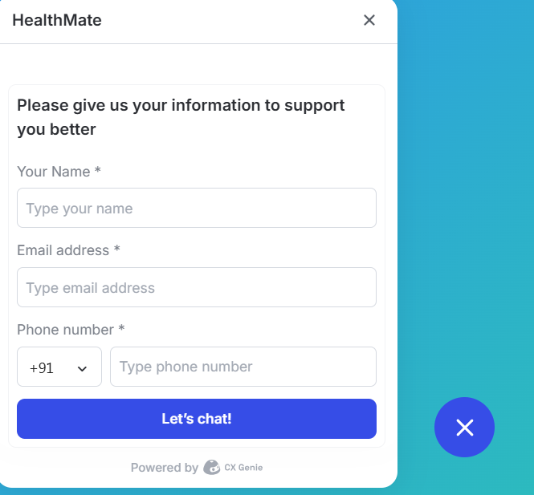
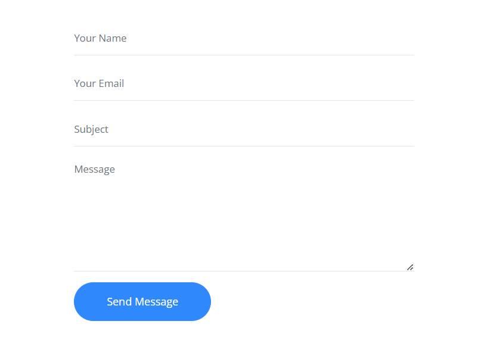

# HealthPredict: Personalized Healthcare Solutions  

**HealthPredict** is a comprehensive web platform designed to provide personalized healthcare services. Built using Django, this application leverages machine learning models to predict disease risks, recommend treatments, and engage users in proactive health management.  

## Project Overview  
HealthPredict offers a range of features to help users monitor and manage their health. Key components include a symptom checker, an interactive health dashboard, appointment scheduling, and a chatbot. The platform provides users with disease risk predictions, personalized treatment plans, and insights based on individual health data.  

## Motivation  
The healthcare industry increasingly values personalized medicine, which can lead to improved patient outcomes and reduced healthcare costs by focusing on prevention and early intervention. HealthPredict aims to make personalized healthcare accessible, engaging, and data-driven.  

## Features  

1. **Login/Signup**: Secure user authentication system for account creation and login.  
     

2. **Symptom Checker**: Users can enter symptoms and receive probable disease predictions using machine learning.  
     

3. **Add Doctor**: Admins can add and manage doctor profiles for patient consultation.  
     

4. **Make an Appointment**: Users can book and manage their appointments with healthcare professionals.  
     

5. **Interactive Health Dashboard**: Visualizes user health metrics, risk scores, and progress.
     

7. **Chatbot Support**: Provides interactive assistance to guide users through the platform.
     

8. **Contact Form**: Users can reach out for support and additional assistance.
    

## Project Structure  

- **Frontend**: Built with HTML, CSS, JavaScript, and React.js for an intuitive and responsive interface.  
- **Backend**: Powered by Django (Python) with RESTful APIs for smooth communication between frontend and backend.  
- **Machine Learning**: Implements classification models for disease risk prediction.  
- **Database**: Uses PostgreSQL for structured data and MongoDB for unstructured data (e.g., user feedback).  
- **Data Visualization**: Utilizes D3.js and Plotly for interactive graphs and charts on the health dashboard.  
- **Security**: Employs robust authentication, authorization, and data encryption mechanisms to ensure user data protection.  


## Installation and Setup
1. **Clone the Repository**
   ```bash
   git clone <repository-link>

2. **Install Dependencies**
   ```bash
   pip install -r requirements.txt

3. **Run Migrations**
   ```bash
   python manage.py migrate

4. **Run the Server**
   ```bash
   python manage.py runserver

5. **Access the Application** by navigating to `http://127.0.0.1:8000` in your web browser.

## Usage
- **User Registration**: Sign up to create a profile and start personalizing your health insights.
- **Symptom Checker**: Enter symptoms to get probable diseases and view descriptions.
- **Health Dashboard**: Monitor your health metrics and view detailed visualizations.
- **Appointment Scheduling**: Make appointments with healthcare providers through the platform.
- **Chatbot Interaction**: Use the chatbot for assistance with navigating the platform and getting health information.

Let me know if you need additional sections or any modifications!
